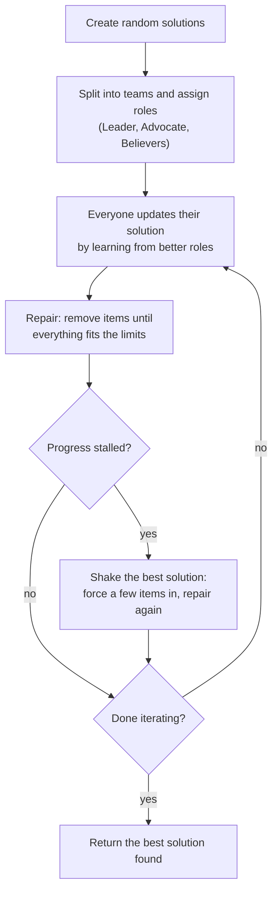
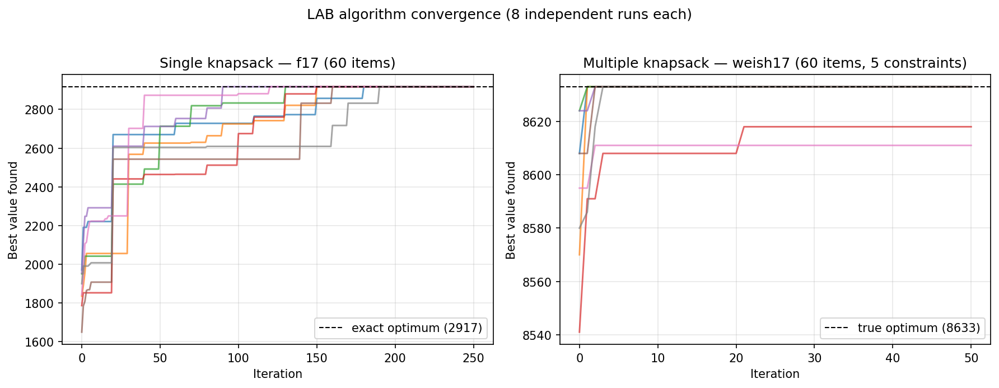

<div align="center">

# Solving the 0-1 Knapsack Problem with the LAB Algorithm

[](https://github.com/mustafa-droid18/Solving-the-0-1-Knapsack-Problem-Using-the-LAB-Algorithm/actions/workflows/ci.yml)
[](https://www.python.org/)
[](LICENSE)
[](https://link.springer.com/rwe/10.1007/978-981-97-3820-5_59)

A fast, tested Python implementation of the Leader-Advocate-Believer (LAB) algorithm,
applied to the single and multidimensional 0-1 knapsack problems.

</div>

This repository is the companion code for the book chapter:

> Poonawala, M. & Kulkarni, A.J. (2024). [Solving the 0-1 Knapsack Problem Using LAB Algorithm](https://link.springer.com/rwe/10.1007/978-981-97-3820-5_59). In *Handbook of Formal Optimization*, Springer Nature Singapore, pp. 955-978.

## The problem, in plain words

Imagine a backpack that can only carry a limited weight. You have a pile of items, and each one has a weight and a value. Which items should you pack to get the most value without going over the limit? That is the knapsack problem.

It sounds simple, but it gets out of hand quickly. With 75 items there are more possible combinations than grains of sand on Earth, so checking every option is impossible. The same puzzle shows up everywhere in the real world: loading cargo, allocating budgets, picking investments.

The multidimensional version is the same idea with several limits at once. Think of a backpack with a weight limit, a volume limit, and a size limit, where every item counts against all of them at the same time.

## The algorithm, in plain words

LAB is inspired by how people improve inside a group. The population of candidate solutions is split into teams, and every team member gets a role based on how good their solution is:

- The **Leader** has the best solution in the team. Leaders learn from the best solution found anywhere (the global leader).
- The **Advocate** has the second best. Advocates learn from their team's leader.
- The **Believers** are everyone else. They learn from their leader and advocate.

Each round, every member moves their solution a little closer to the people above them, with a touch of randomness so the teams do not all rush to the same answer. If a solution packs too much, a repair step removes the least valuable items until it fits.

One more trick matters a lot: when progress stalls, the algorithm gives the best solution a shake. It forces a handful of unpacked items into the bag and lets the repair step sort out what no longer fits. That little jolt is often exactly what is needed to escape a dead end and find a better packing.



## Results

The numbers below come from 30 independent runs per problem. Every answer was checked against the true optimum: for the single knapsack problems we computed the optima exactly with dynamic programming, and for the multidimensional ones the optima come from the standard SAC-94 benchmark files.

| Benchmark | Problems | Optimum found | Worst case |
|---|---|---|---|
| Single knapsack (f1 to f20, 4 to 75 items) | 20 | **19 of 20** | within 0.1% of optimal |
| Multidimensional knapsack (weish01 to weish30, 30 to 90 items, 5 limits) | 30 | **20 of 30** | within 0.7% of optimal |

The single knapsack count of 19 includes f2 and f18, which need more than 30 runs to land on their optima (they hit only about once in every 25 to 40 runs). The only problem that stays unsolved is f19, which plateaus at 3220 against an optimum of 3223, a gap of 0.09%.

It is quick, too. A full 30-run benchmark of a 75-item problem finishes in about 1.5 seconds on a laptop.



<details>
<summary><b>Full results: single knapsack (f1 to f20)</b></summary>

<br>

Bold means the true optimum was found.

| Problem | Items | Capacity | Optimum | Best | Mean | Worst | Std |
|---|---|---|---|---|---|---|---|
| f1 | 10 | 269 | 295 | **295** | 292.0 | 290 | 1.63 |
| f2 | 20 | 878 | 1024 | 1018 | 1018.0 | 1018 | 0.00 |
| f3 | 4 | 20 | 35 | **35** | 35.0 | 35 | 0.00 |
| f4 | 4 | 11 | 23 | **23** | 22.8 | 22 | 0.43 |
| f5 | 15 | 375 | 481.07 | **481.07** | 481.07 | 481.07 | 0.00 |
| f6 | 10 | 60 | 52 | **52** | 52.0 | 52 | 0.00 |
| f7 | 7 | 50 | 107 | **107** | 105.3 | 96 | 3.74 |
| f8 | 23 | 10000 | 9767 | **9767** | 9754.0 | 9738 | 8.40 |
| f9 | 5 | 80 | 130 | **130** | 130.0 | 130 | 0.00 |
| f10 | 20 | 879 | 1025 | **1025** | 1019.2 | 1019 | 1.10 |
| f11 | 30 | 577 | 1437 | **1437** | 1437.0 | 1437 | 0.00 |
| f12 | 35 | 655 | 1689 | **1689** | 1684.6 | 1684 | 1.55 |
| f13 | 40 | 819 | 1821 | **1821** | 1816.2 | 1816 | 0.91 |
| f14 | 45 | 907 | 2033 | **2033** | 2030.2 | 1979 | 11.11 |
| f15 | 50 | 882 | 2440 | **2440** | 2424.6 | 2268 | 36.34 |
| f16 | 55 | 1050 | 2651 | **2651** | 2618.9 | 2430 | 67.48 |
| f17 | 60 | 1006 | 2917 | **2917** | 2917.0 | 2917 | 0.00 |
| f18 | 65 | 1319 | 2818 | 2816 | 2773.6 | 2546 | 83.83 |
| f19 | 70 | 1426 | 3223 | 3216 | 3149.8 | 2737 | 141.56 |
| f20 | 75 | 1433 | 3614 | **3614** | 3570.9 | 3216 | 111.28 |

The table shows the standard protocol of 30 runs with seeds 0 to 29, under which 17 problems reach their optimum. Two more fall with extra attempts: f2 reaches 1024 and f18 reaches 2818 when given around 100 runs or a larger population (for example `--groups 5`). f19 is the one problem that resists: across 500 runs with various settings its best stays at 3220, a 0.09% gap.

</details>

<details>
<summary><b>Full results: multidimensional knapsack (weish01 to weish30)</b></summary>

<br>

Bold means the true optimum was found.

| Problem | Items | Optimum | Best | Gap | Mean | Std |
|---|---|---|---|---|---|---|
| weish01 | 30 | 4554 | **4554** | 0.00% | 4385.9 | 115.41 |
| weish02 | 30 | 4536 | 4531 | 0.11% | 4510.7 | 27.42 |
| weish03 | 30 | 4115 | **4115** | 0.00% | 4092.6 | 28.57 |
| weish04 | 30 | 4561 | **4561** | 0.00% | 4547.5 | 29.02 |
| weish05 | 30 | 4514 | **4514** | 0.00% | 4508.6 | 16.48 |
| weish06 | 40 | 5557 | 5518 | 0.70% | 5480.0 | 45.28 |
| weish07 | 40 | 5567 | 5541 | 0.47% | 5406.2 | 70.35 |
| weish08 | 40 | 5605 | **5605** | 0.00% | 5578.7 | 33.65 |
| weish09 | 40 | 5246 | **5246** | 0.00% | 5242.8 | 12.56 |
| weish10 | 50 | 6339 | 6338 | 0.02% | 6282.2 | 49.60 |
| weish11 | 50 | 5643 | **5643** | 0.00% | 5541.8 | 63.78 |
| weish12 | 50 | 6339 | 6338 | 0.02% | 6278.4 | 82.56 |
| weish13 | 50 | 6159 | **6159** | 0.00% | 6136.7 | 21.14 |
| weish14 | 60 | 6954 | 6935 | 0.27% | 6883.9 | 39.83 |
| weish15 | 60 | 7486 | **7486** | 0.00% | 7462.0 | 14.97 |
| weish16 | 60 | 7289 | **7289** | 0.00% | 7285.6 | 4.73 |
| weish17 | 60 | 8633 | **8633** | 0.00% | 8630.9 | 3.87 |
| weish18 | 70 | 9580 | 9548 | 0.33% | 9528.8 | 18.07 |
| weish19 | 70 | 7698 | **7698** | 0.00% | 7661.7 | 33.19 |
| weish20 | 70 | 9450 | 9433 | 0.18% | 9412.0 | 26.39 |
| weish21 | 70 | 9074 | **9074** | 0.00% | 9060.8 | 13.99 |
| weish22 | 80 | 8947 | 8929 | 0.20% | 8889.2 | 42.68 |
| weish23 | 80 | 8344 | **8344** | 0.00% | 8304.6 | 35.00 |
| weish24 | 80 | 10220 | 10204 | 0.16% | 10154.8 | 20.17 |
| weish25 | 80 | 9939 | **9939** | 0.00% | 9921.8 | 13.08 |
| weish26 | 90 | 9584 | **9584** | 0.00% | 9528.9 | 58.35 |
| weish27 | 90 | 9819 | **9819** | 0.00% | 9689.4 | 96.56 |
| weish28 | 90 | 9492 | **9492** | 0.00% | 9414.8 | 21.58 |
| weish29 | 90 | 9410 | **9410** | 0.00% | 9374.2 | 22.37 |
| weish30 | 90 | 11191 | **11191** | 0.00% | 11185.0 | 7.20 |

</details>

Raw output of the full sweep: [assets/benchmark_results.json](assets/benchmark_results.json)

### A note on the original notebook results

The multidimensional results published with the original notebooks never reached the true optima, and the reason turned out to be a small data bug, not the algorithm. A line in the setup code quietly added 1 to every item weight (it was a workaround for items with zero weight), so the code was solving a slightly harder problem than the real benchmark. For most instances the true optimum did not even fit under those inflated weights, which put a hard ceiling on the scores. This package keeps the benchmark data exact, fixes a loop bug that had disabled the shake step, and always reports the best solution found rather than the last one. With those corrections, the same LAB design reaches the true optimum on 20 of the 30 problems.

## Installation

```bash
git clone https://github.com/mustafa-droid18/Solving-the-0-1-Knapsack-Problem-Using-the-LAB-Algorithm.git
cd Solving-the-0-1-Knapsack-Problem-Using-the-LAB-Algorithm
pip install -e .
```

The core only needs NumPy. Two optional extras are available:

```bash
pip install -e ".[dev]"        # adds pytest
pip install -e ".[notebooks]"  # adds pandas, matplotlib, seaborn, jupyter
```

## Usage

### From the command line

```console
$ lab-knapsack single f17 --runs 30 --seed 0
Instance f17: 60 items, capacity 1006
Best               : 2917
Known optimum      : 2917  (gap 0.00%)

$ lab-knapsack multiple "Multiple Knapsack Problem/Dataset/weish01.dat" --runs 30 --seed 0
Instance ...weish01.dat: 30 items, 5 constraints
Best               : 4554
Known optimum      : 4554  (gap 0.00%)
```

### From Python

```python
from lab_knapsack import LAB, SingleKnapsack, load_f_instance, load_weish

# Solve a built-in benchmark
problem = load_f_instance("f17")
result = LAB(problem, seed=42).solve(iterations=250)
print(result.best_value)                              # 2917.0
print(problem.to_input_order(result.best_selection))  # 0/1 choice for each item

# Or bring your own problem
problem = SingleKnapsack(weights=[95, 4, 60, 32], values=[55, 10, 47, 5], capacity=130)
result = LAB(problem, seed=0).solve()
```

## What is in this repository

```
lab_knapsack/                  the solver package
├── core.py                    LAB engine: roles, updates, the shake step
├── problems.py                knapsack models: scoring and repair
├── datasets.py                f1-f20 instances plus a weish file parser
└── cli.py                     the lab-knapsack command
tests/                         pytest suite, runs in CI on every push
Single Knapsack Problem/       original research notebook and results
Multiple Knapsack Problem/     original research notebook, weish data, results
assets/                        plots and raw benchmark output
```

The two Jupyter notebooks document the original research step by step and are kept as a readable walkthrough of how the method was developed:

- [Single_Knapsack_Problem.ipynb](Single%20Knapsack%20Problem/Single_Knapsack_Problem.ipynb)
- [Multiple_Knapsack_Problem.ipynb](Multiple%20Knapsack%20Problem/Multiple_Knapsack_Problem.ipynb)

## Running the tests

```bash
pip install -e ".[dev]"
pytest tests/ -v
```

## Citation

If you use this code, please cite the book chapter:

```bibtex
@incollection{poonawala2024knapsack,
  title     = {Solving the 0-1 Knapsack Problem Using LAB Algorithm},
  author    = {Poonawala, Mustafa and Kulkarni, Anand J},
  booktitle = {Handbook of Formal Optimization},
  pages     = {955--978},
  year      = {2024},
  publisher = {Springer Nature Singapore}
}
```

and the paper that introduced the LAB algorithm:

```bibtex
@article{reddy2023lab,
  title   = {LAB: a leader-advocate-believer-based optimization algorithm},
  author  = {Reddy, Ruturaj and Kulkarni, Anand J and Krishnasamy, Ganesh and Shastri, Apoorva S and Gandomi, Amir H},
  journal = {Soft Computing},
  volume  = {27},
  pages   = {7209--7243},
  year    = {2023},
  doi     = {10.1007/s00500-023-08033-y}
}
```

## License

Released under the [MIT License](LICENSE).
