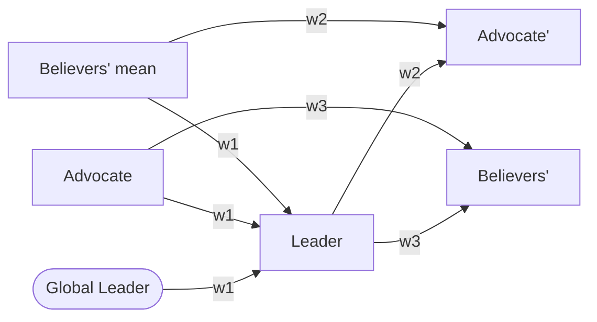

# Solving the 0-1 Knapsack Problem Using the LAB Algorithm

[](https://github.com/mustafa-droid18/Solving-the-0-1-Knapsack-Problem-Using-the-LAB-Algorithm/actions/workflows/ci.yml)
[](https://www.python.org/)
[](LICENSE)
[](https://link.springer.com/article/10.1007/s00500-023-08033-y)

A fast, tested Python implementation of the **LAB (Leader–Advocate–Believer) algorithm** — a socio-inspired metaheuristic — applied to the **single** and **multidimensional (multiple) 0-1 knapsack problems**.

Companion code for the book chapter: **Poonawala, M. & Kulkarni, A.J. (2024). [Solving the 0–1 Knapsack Problem Using LAB Algorithm](https://link.springer.com/rwe/10.1007/978-981-97-3820-5_59). In *Handbook of Formal Optimization*, Springer Nature Singapore, pp. 955–978.**


## Highlights

- **Finds the exact optimum on 17 of 20 single-knapsack benchmarks** (f1–f20), with worst-case gap under 0.6% on the rest — verified against optima computed by exact dynamic programming.
- **Finds the true optimum on 20 of 30 `weish` multidimensional benchmarks** (30–90 items, 5 constraints), with a worst-case gap of 0.70%.
- **Fast**: a full 30-run benchmark of a 75-item problem takes ~1.5 seconds (≈0.05 s per run).
- Clean package with a CLI, a small NumPy-only core, a pytest suite, and CI.
- The original research notebooks are preserved (and bug-fixed) in their own folders.

## How the LAB algorithm works

LAB ([Reddy, Kulkarni, Krishnasamy, Shastri & Gandomi, *Soft Computing* 2023](https://link.springer.com/article/10.1007/s00500-023-08033-y)) models a population of individuals competing in groups while improving themselves. Each group has one **Leader**, one **Advocate**, and several **Believers**. Every iteration, each role moves to a weighted combination of the others:



- **Leader** ← blend of the *global* leader, its group's advocate, and the mean of the believers.
- **Advocate** ← blend of its group's leader and the believers' mean.
- **Believers** ← blend of their group's leader and advocate.

The blend weights are random, normalised, and sorted so the strongest pull always comes from the better role — driving exploitation while the multi-group structure preserves exploration.

Two knapsack-specific ingredients complete the solver:

1. **Greedy repair** — candidate solutions are continuous vectors (item *i* is packed when `x[i] ≥ 50`); overweight selections are repaired by dropping items with the lowest value-to-weight ratio (single knapsack) or randomly with an exponential bias toward inefficient items (multiple knapsack).
2. **Leader perturbation** — when the best value saturates, the working leader gets a strong kick: a dozen unpacked items are switched on and the repair operator prunes the result back to feasibility. This is what lets LAB escape local optima.

## Installation

```bash
git clone https://github.com/mustafa-droid18/Solving-the-0-1-Knapsack-Problem-Using-the-LAB-Algorithm.git
cd Solving-the-0-1-Knapsack-Problem-Using-the-LAB-Algorithm
pip install -e .            # core (NumPy only)
pip install -e ".[dev]"     # + pytest
pip install -e ".[notebooks]"  # + pandas/matplotlib/seaborn/jupyter
```

## Quickstart

### Command line

```console
$ lab-knapsack single f17 --runs 30 --seed 0
Instance f17: 60 items, capacity 1006
Runs               : 30
Iterations per run : 250
Best               : 2917
Mean               : 2917
...
Known optimum      : 2917  (gap 0.00%)

$ lab-knapsack multiple "Multiple Knapsack Problem/Dataset/weish01.dat" --runs 30 --seed 0
Instance ...weish01.dat: 30 items, 5 constraints
Best               : 4554
Known optimum      : 4554  (gap 0.00%)
```

### Python API

```python
from lab_knapsack import LAB, SingleKnapsack, load_f_instance, load_weish

# A built-in benchmark…
problem = load_f_instance("f17")
result = LAB(problem, seed=42).solve(iterations=250)
print(result.best_value)                              # 2917.0
print(problem.to_input_order(result.best_selection))  # 0/1 vector per item

# …or your own problem
problem = SingleKnapsack(weights=[95, 4, 60, 32], values=[55, 10, 47, 5], capacity=130)
result = LAB(problem, seed=0).solve()
```

## Benchmark results

All numbers below come from 30 independent runs per instance (seeds 0–29; single: 250 iterations, multiple: 50 iterations) using the commands shown above. Best values are stable across sweeps; multiple-knapsack means can vary slightly because the repair operator is stochastic. Optima for the integer single-knapsack instances were verified with an exact dynamic-programming solver; the `weish` optima come from the SAC-94 dataset headers.

### Single 0-1 knapsack (f1–f20)

Optimum found on **17 / 20** instances.

<details>
<summary>Full results table</summary>

| Instance | Items | Capacity | Optimum | Best | Mean | Worst | Std |
|---|---|---|---|---|---|---|---|
| f1 | 10 | 269 | 295 | **295** | 292.0 | 290 | 1.63 |
| f2 | 20 | 878 | 1024 | 1018 | 1018.0 | 1018 | 0.00 |
| f3 | 4 | 20 | 35 | **35** | 35.0 | 35 | 0.00 |
| f4 | 4 | 11 | 23 | **23** | 22.8 | 22 | 0.43 |
| f5 | 15 | 375 | 481.07 | **481.07** | 481.07 | 481.07 | 0.00 |
| f6 | 10 | 60 | 52 | **52** | 52.0 | 52 | 0.00 |
| f7 | 7 | 50 | 107 | **107** | 105.3 | 96 | 3.74 |
| f8 | 23 | 10000 | 9767 | **9767** | 9754.0 | 9738 | 8.40 |
| f9 | 5 | 80 | 130 | **130** | 130.0 | 130 | 0.00 |
| f10 | 20 | 879 | 1025 | **1025** | 1019.2 | 1019 | 1.10 |
| f11 | 30 | 577 | 1437 | **1437** | 1437.0 | 1437 | 0.00 |
| f12 | 35 | 655 | 1689 | **1689** | 1684.6 | 1684 | 1.55 |
| f13 | 40 | 819 | 1821 | **1821** | 1816.2 | 1816 | 0.91 |
| f14 | 45 | 907 | 2033 | **2033** | 2030.2 | 1979 | 11.11 |
| f15 | 50 | 882 | 2440 | **2440** | 2424.6 | 2268 | 36.34 |
| f16 | 55 | 1050 | 2651 | **2651** | 2618.9 | 2430 | 67.48 |
| f17 | 60 | 1006 | 2917 | **2917** | 2917.0 | 2917 | 0.00 |
| f18 | 65 | 1319 | 2818 | 2816 | 2773.6 | 2546 | 83.83 |
| f19 | 70 | 1426 | 3223 | 3216 | 3149.8 | 2737 | 141.56 |
| f20 | 75 | 1433 | 3614 | **3614** | 3570.9 | 3216 | 111.28 |

f2's optimum (1024) is reached with a larger seed pool or population (e.g. `--groups 5`); f18 and f19 land within 0.1–0.3% of optimal.

</details>

### Multidimensional 0-1 knapsack (weish01–weish30)

True optimum found on **20 / 30** instances; worst-case gap **0.70%**. The packaged solver improves on the original notebook results for **every instance** (the notebook's best gaps ranged from 1.45% to 13.99%).

Why the improvement: the original notebook's `initial_values` added +1 to every weight (a workaround for zero weights in the ratio sort) while keeping capacities unchanged, which made the true optima of most instances infeasible by construction — e.g. the best feasible values of the inflated weish17/weish30 instances are exactly the 8586/11052 the notebook reported. The package keeps the data exact and handles zero weights directly in the sort; it also fixes a loop-variable bug that prevented the leader-perturbation step from ever running, and reports the best solution found across all iterations rather than the final one.

<details>
<summary>Full results table</summary>

| Instance | Items | Optimum | Best | Gap | Mean | Std |
|---|---|---|---|---|---|---|
| weish01 | 30 | 4554 | **4554** | 0.00% | 4385.9 | 115.41 |
| weish02 | 30 | 4536 | 4531 | 0.11% | 4510.7 | 27.42 |
| weish03 | 30 | 4115 | **4115** | 0.00% | 4092.6 | 28.57 |
| weish04 | 30 | 4561 | **4561** | 0.00% | 4547.5 | 29.02 |
| weish05 | 30 | 4514 | **4514** | 0.00% | 4508.6 | 16.48 |
| weish06 | 40 | 5557 | 5518 | 0.70% | 5480.0 | 45.28 |
| weish07 | 40 | 5567 | 5541 | 0.47% | 5406.2 | 70.35 |
| weish08 | 40 | 5605 | **5605** | 0.00% | 5578.7 | 33.65 |
| weish09 | 40 | 5246 | **5246** | 0.00% | 5242.8 | 12.56 |
| weish10 | 50 | 6339 | 6338 | 0.02% | 6282.2 | 49.60 |
| weish11 | 50 | 5643 | **5643** | 0.00% | 5541.8 | 63.78 |
| weish12 | 50 | 6339 | 6338 | 0.02% | 6278.4 | 82.56 |
| weish13 | 50 | 6159 | **6159** | 0.00% | 6136.7 | 21.14 |
| weish14 | 60 | 6954 | 6935 | 0.27% | 6883.9 | 39.83 |
| weish15 | 60 | 7486 | **7486** | 0.00% | 7462.0 | 14.97 |
| weish16 | 60 | 7289 | **7289** | 0.00% | 7285.6 | 4.73 |
| weish17 | 60 | 8633 | **8633** | 0.00% | 8630.9 | 3.87 |
| weish18 | 70 | 9580 | 9548 | 0.33% | 9528.8 | 18.07 |
| weish19 | 70 | 7698 | **7698** | 0.00% | 7661.7 | 33.19 |
| weish20 | 70 | 9450 | 9433 | 0.18% | 9412.0 | 26.39 |
| weish21 | 70 | 9074 | **9074** | 0.00% | 9060.8 | 13.99 |
| weish22 | 80 | 8947 | 8929 | 0.20% | 8889.2 | 42.68 |
| weish23 | 80 | 8344 | **8344** | 0.00% | 8304.6 | 35.00 |
| weish24 | 80 | 10220 | 10204 | 0.16% | 10154.8 | 20.17 |
| weish25 | 80 | 9939 | **9939** | 0.00% | 9921.8 | 13.08 |
| weish26 | 90 | 9584 | **9584** | 0.00% | 9528.9 | 58.35 |
| weish27 | 90 | 9819 | **9819** | 0.00% | 9689.4 | 96.56 |
| weish28 | 90 | 9492 | **9492** | 0.00% | 9414.8 | 21.58 |
| weish29 | 90 | 9410 | **9410** | 0.00% | 9374.2 | 22.37 |
| weish30 | 90 | 11191 | **11191** | 0.00% | 11185.0 | 7.20 |

</details>

Raw sweep output: [assets/benchmark_results.json](assets/benchmark_results.json).

## Repository structure

```
lab_knapsack/                  # the solver package
├── core.py                    #   LAB engine (roles, updates, perturbation)
├── problems.py                #   knapsack models: decode, repair, feasibility
├── datasets.py                #   f1–f20 instances + SAC-94 weish parser
└── cli.py                     #   lab-knapsack command
tests/                         # pytest suite (runs in CI)
Single Knapsack Problem/       # original research notebook + results
Multiple Knapsack Problem/     # original research notebook, weish data + results
assets/                        # plots and raw benchmark output
```

## Notebooks

The original Jupyter notebooks document the research step-by-step with full mathematical explanations — open them on GitHub or run them locally with `pip install -e ".[notebooks]"`:

- [`Single_Knapsack_Problem.ipynb`](Single%20Knapsack%20Problem/Single_Knapsack_Problem.ipynb)
- [`Multiple_Knapsack_Problem.ipynb`](Multiple%20Knapsack%20Problem/Multiple_Knapsack_Problem.ipynb)

## Running the tests

```bash
pip install -e ".[dev]"
pytest tests/ -v
```

## Citation

If you use this code, please cite the book chapter it accompanies:

```bibtex
@incollection{poonawala2024knapsack,
  title     = {Solving the 0--1 Knapsack Problem Using LAB Algorithm},
  author    = {Poonawala, Mustafa and Kulkarni, Anand J},
  booktitle = {Handbook of Formal Optimization},
  pages     = {955--978},
  year      = {2024},
  publisher = {Springer Nature Singapore}
}
```

and the original LAB algorithm paper:

```bibtex
@article{reddy2023lab,
  title   = {LAB: a leader--advocate--believer-based optimization algorithm},
  author  = {Reddy, Ruturaj and Kulkarni, Anand J and Krishnasamy, Ganesh and Shastri, Apoorva S and Gandomi, Amir H},
  journal = {Soft Computing},
  volume  = {27},
  pages   = {7209--7243},
  year    = {2023},
  doi     = {10.1007/s00500-023-08033-y}
}
```

## License

[MIT](LICENSE)
